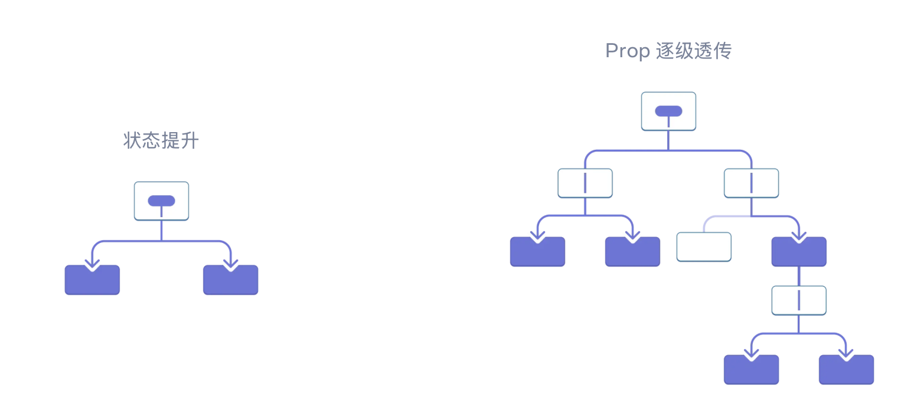
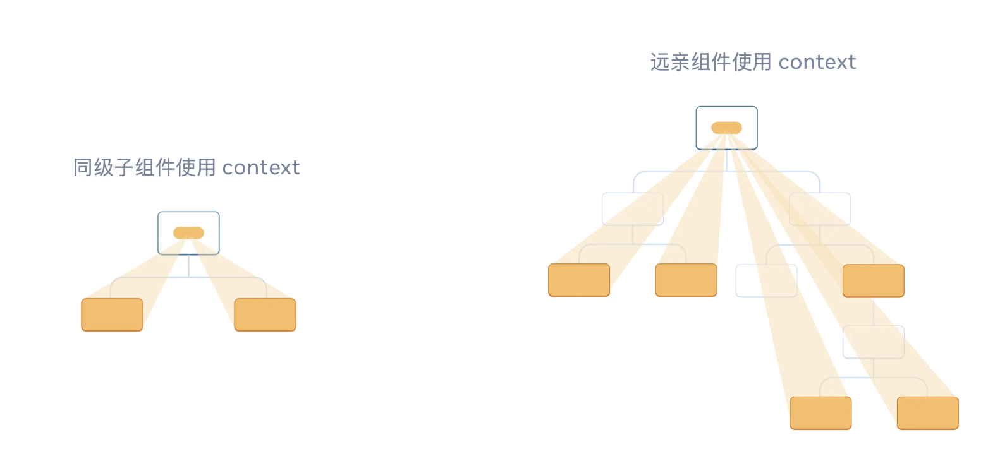

# 使用Context传递深层参数
<a href='https://react.dev/learn/passing-data-deeply-with-context'>1、React官方文档--Context</a>

## 为什么使用context
### 1. props与context
#### props 传递方式

#### props 特点
+ 通过组件树从父组件向子组件逐层传递信息
+ 必须通过中间组件显式地向下传递
+ 当组件树层级很深时，会导致代码冗长复杂
+ 中间组件即使不需要使用这些数据，也必须接收并传递
#### props 传递的缺点
```
// 深层传递示例 - 不推荐的方式
function App() {
  const [user, setUser] = useState({ name: 'John', age: 30 });
  
  return (
    <Header user={user} />
  );
}

function Header({ user }) {
  // Header 组件本身不需要 user，但为了传递不得不接收
  return (
    <div>
      <Navigation user={user} />
    </div>
  );
}

function Navigation({ user }) {
  // Navigation 也不需要 user，继续传递
  return <UserProfile user={user} />;
}

function UserProfile({ user }) {
  // 终于到了需要 user 的组件
  return <div>Welcome, {user.name}!</div>;
}
```
#### context 传递方式

#### context 特点
+ 可以直接将信息传递给任意深度的子组件
+ 不需要通过中间组件显式传递
+ 让组件树更加简洁清晰
+ 中间组件不需要关心不相关的数据
## 怎么用Context
### 1. 创建Context
使用`React.createContext()` 创建 `Context` 对象：
```
import { createContext } from 'react';
const MyContext = createContext(defaultValue);
```
### 2. 提供Context值
使用 `Context.Provider` 组件来提供 `Context` 值：
```
<MyContext.Provider value={/* 要传递的值 */}>
  {/* 子组件 */}
</MyContext.Provider>
```
### 3. 消费Context值
三种方式可以使用Context值
#### 1. 使用`Context.Consumer`组件
```
<MyContext.Consumer>
  {value => /* 基于context值进行渲染 */}
</MyContext.Consumer>
```
#### 2. 使用`useContext`钩子
```
import { useContext } from 'react';

function MyComponent() {
  const value = useContext(MyContext);
  // 基于value进行渲染
}
```
#### 3. 类组件中使用`contextType`属性
```
class MyComponent extends React.Component {
  static contextType = MyContext;
  render() {
    const value = this.context;
    // 基于value进行渲染
  }
}
```

## 什么时候用Context
### 1. 全局状态管理
+ 用户认证信息
+ 主题偏好设置
+ 语言国际化
+ 用户权限
### 2.避免 Props Drilling
+ 当多个嵌套组件需要相同数据时
+ 中间组件不需要使用这些数据时
### 3. 配置信息
+ API 基础路径
+ 功能开关
+ 应用配置
> <b>不适合使用Context的场景</b>
> 1. 频繁更新的数据
>> + Context 值变化会导致所有消费组件重新渲染
>> + 对于高频更新，考虑使用状态管理库或组合组件
> 2. 组件本地状态
>> + 只在单个组件内部使用的状态
>> + 简单的父子组件通信
## Example
### 用户主题切换
```
import React, { createContext, useContext, useState } from 'react';

// 1. 创建 Context
const ThemeContext = createContext();

// 2. 创建 Provider 组件
function ThemeProvider({ children }) {
  const [theme, setTheme] = useState('light');
  
  const toggleTheme = () => {
    setTheme(prevTheme => prevTheme === 'light' ? 'dark' : 'light');
  };
  
  // Context 值可以包含状态和函数
  const value = {
    theme,
    toggleTheme,
    isDark: theme === 'dark'
  };
  
  return (
    <ThemeContext.Provider value={value}>
      {children}
    </ThemeContext.Provider>
  );
}

// 3. 创建消费 Context 的组件
function ThemeToggleButton() {
  const { theme, toggleTheme } = useContext(ThemeContext);
  
  return (
    <button onClick={toggleTheme} style={{
      padding: '10px',
      backgroundColor: theme === 'light' ? '#fff' : '#333',
      color: theme === 'light' ? '#000' : '#fff',
      border: '1px solid #ccc'
    }}>
      切换到 {theme === 'light' ? '暗色' : '亮色'} 主题
    </button>
  );
}

function UserProfile() {
  const { theme, isDark } = useContext(ThemeContext);
  
  return (
    <div style={{
      padding: '20px',
      backgroundColor: isDark ? '#1a1a1a' : '#f5f5f5',
      color: isDark ? '#fff' : '#000'
    }}>
      <h3>用户资料</h3>
      <p>当前主题: {theme}</p>
      <ThemeToggleButton />
    </div>
  );
}

function Navigation() {
  const { isDark } = useContext(ThemeContext);
  
  return (
    <nav style={{
      backgroundColor: isDark ? '#2d2d2d' : '#e9e9e9',
      padding: '10px'
    }}>
      <ul style={{ listStyle: 'none', display: 'flex', gap: '20px' }}>
        <li>首页</li>
        <li>关于</li>
        <li>联系</li>
      </ul>
    </nav>
  );
}

// 4. 应用根组件
function App() {
  return (
    <ThemeProvider>
      <div>
        <Navigation />
        <UserProfile />
      </div>
    </ThemeProvider>
  );
}
export default App;
```

### 用户认证
```
import React, { createContext, useContext, useState } from 'react';

// 创建认证 Context
const AuthContext = createContext();

function AuthProvider({ children }) {
  const [user, setUser] = useState(null);
  const [loading, setLoading] = useState(false);
  
  const login = async (email, password) => {
    setLoading(true);
    // 模拟 API 调用
    setTimeout(() => {
      setUser({ id: 1, name: 'John Doe', email });
      setLoading(false);
    }, 1000);
  };
  
  const logout = () => {
    setUser(null);
  };
  
  const value = {
    user,
    loading,
    login,
    logout,
    isAuthenticated: !!user
  };
  
  return (
    <AuthContext.Provider value={value}>
      {children}
    </AuthContext.Provider>
  );
}

// 使用 Context 的组件
function LoginForm() {
  const { login, loading } = useContext(AuthContext);
  const [email, setEmail] = useState('');
  const [password, setPassword] = useState('');
  
  const handleSubmit = (e) => {
    e.preventDefault();
    login(email, password);
  };
  
  if (loading) {
    return <div>登录中...</div>;
  }
  
  return (
    <form onSubmit={handleSubmit}>
      <input
        type="email"
        value={email}
        onChange={(e) => setEmail(e.target.value)}
        placeholder="邮箱"
      />
      <input
        type="password"
        value={password}
        onChange={(e) => setPassword(e.target.value)}
        placeholder="密码"
      />
      <button type="submit">登录</button>
    </form>
  );
}

function UserDashboard() {
  const { user, logout } = useContext(AuthContext);
  
  return (
    <div>
      <h2>欢迎, {user.name}!</h2>
      <p>邮箱: {user.email}</p>
      <button onClick={logout}>退出登录</button>
    </div>
  );
}

function App() {
  const { isAuthenticated } = useContext(AuthContext);
  
  return (
    <div>
      <h1>我的应用</h1>
      {isAuthenticated ? <UserDashboard /> : <LoginForm />}
    </div>
  );
}

// 在根组件包裹 Provider
export default function Root() {
  return (
    <AuthProvider>
      <App />
    </AuthProvider>
  );
}
```